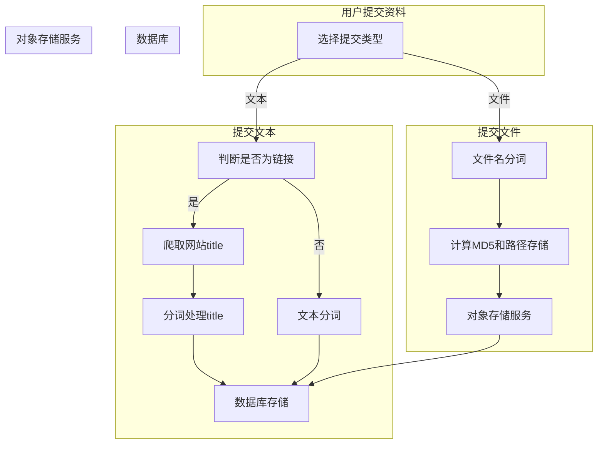

# 资料自动分类网站开发
- 作者：翁岳川
- 版本：v0.0.0
- 时间：2024年1月23日
## 项目简介
本项目是一个资料自动分类网站，用户可以在网站上上传资料，网站会自动对资料进行分类，用户可以通过分类查找资料，也可以通过搜索查找资料。网站还提供了用户注册、登录、修改密码、修改个人信息等功能。
## 项目功能
- 用户模块
  - 用户注册
  - 用户登录
  - 修改密码
  - 修改个人信息
  - 查看个人信息
- 资料模块
  - 上传资料（在这个过程中，到后端其实是可以自动分词的，但是一般不准确，所以也可以在前端进行设置，或者说打上标签，这里是可选项）
  - 下载资料
  - 删除资料
  - 查看资料
  - 搜索资料
    - 按照资料名搜索
    - 按照资料分类搜索
  - 查看资料分类
- 管理员模块
  - 查看用户信息
  - 删除用户
  - 查看资料信息
  - 删除资料
  - 查看资料分类
  - 删除资料分类
## 项目技术
- 前端
  - vue
- 后端
  - golang + gin
  - ES
  - mysql
  - redis
  - ...后期可能考虑使用微服务等框架进行重构，并且引入聊天机器人
## 工作流程

## 依赖安装
```shell
go get -u github.com/gin-gonic/gin
go get -u github.com/go-sql-driver/mysql
go get -u github.com/go-redis/redis
go get -u github.com/olivere/elastic/v7
go get -u gorm.io/gorm
go get -u gorm.io/driver/mysql
go get -u gopkg.in/yaml.v2
go get -u github.com/go-ego/gse
go get -u github.com/sirupsen/logrus
```
## 参考文档
[gse](https://gitee.com/veni0/gse)
## 写在后面
我经常性刷到一些教学视频或者是有意义的视频或者资料会发给我自己的微信里面，但是一段时间之后，我可能要用的时候，记得我发给自己过，但是找不到在那里，所以我就想到了这个，之后只需要将资料通过接口提交给我的后端，然后就可以整理并且分类，之后我就可以通过分类或者搜索来找到我想要的资料了。